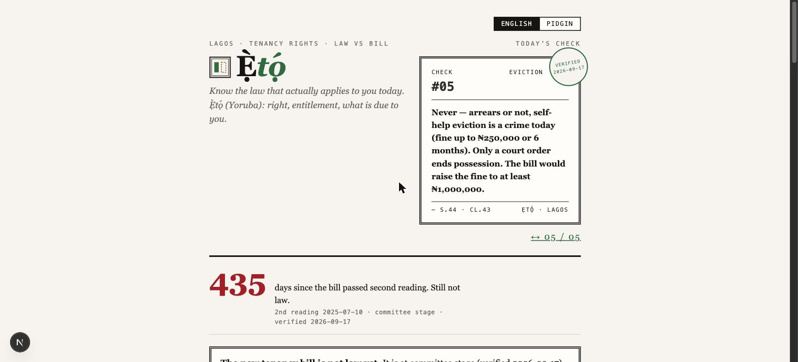
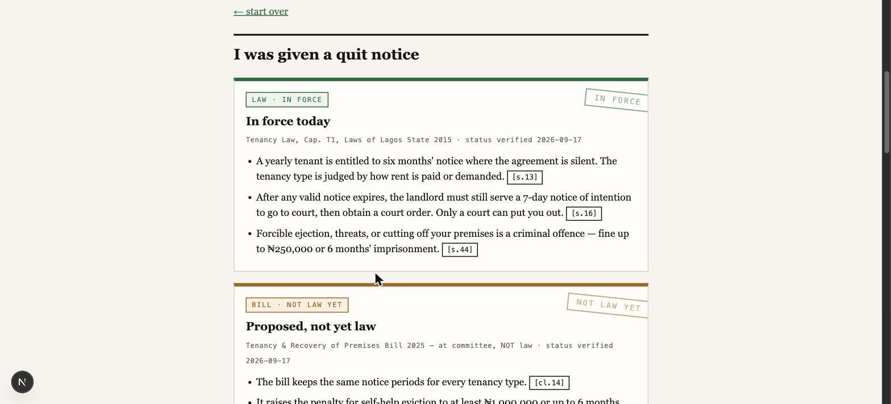
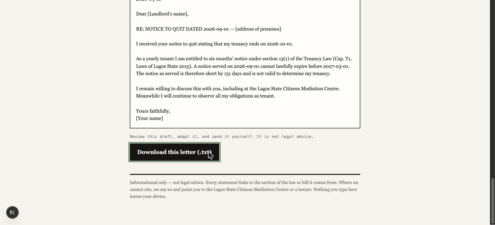

# Ẹ̀tọ́

**Know the law that actually applies to you today.**

Since 2025, the news has told Lagos renters that rent is now paid monthly, that agency
fees are capped, and that illegal eviction now carries a heavy fine. None of that is law.
The bill behind the headlines is still in committee at the Lagos State House of Assembly.
The law that governs every Lagos tenancy today is the Tenancy Law, Cap. T1, Laws of
Lagos State 2015.

Ẹ̀tọ́ is a small web app that keeps the two apart. For any tenancy problem, it shows two
panels that are never mixed: what the current law says, and what the pending bill
proposes. Every sentence carries the exact section it comes from, and you can open the
section text and the official source with one tap. Every answer ends with something you
can act on: a computed date, the right office with a verified address, and a letter or
case file you can download.

> *Ẹ̀tọ́* (Yoruba): right, entitlement, what is due to you.

**Live: [eto-eight.vercel.app](https://eto-eight.vercel.app)**



## Demo


## What it does

**Pick your situation.** Five common problems, in English or Nigerian Pidgin: a rent
increase, a quit notice, a lock out, an agency fee, or checking whether an agent is
registered. The tool asks only for the facts it needs. It also asks where the house is,
because the current law does not apply in Apapa, Ikeja GRA, Ikoyi, and Victoria Island
(section 1(3)).

**Read two panels, never one blend.** Green for the law in force, amber for the bill.
Each panel shows the date its status was last verified. Tap any section chip to read the
exact legal text and open the official gazette or Assembly page it came from.



**Get your dates computed.** Notice periods are calculated by tested code, not by an AI
model. Give it the date you received a quit notice and it returns the earliest lawful end
of your tenancy, and tells you if the notice is short and by how many days.

**Leave with a document.** A reply to a short notice, a complaint to LASRERA, an
incident record, or a case file that assembles your facts, dates, and citations for the
Citizens' Mediation Bureau. Everything downloads as plain text. Nothing you type leaves
your phone.



## Why trust it

- The statute and the bill are stored in this repository with SHA-256 hashes and full
  provenance. Answers are grounded in those fixed texts, never in a live web search.
- Every citation must resolve against the corpus. If a reference does not exist, the
  answer fails instead of shipping.
- Status is a field, not prose. Each panel is stamped with the date it was last checked,
  and a refresh tool re-verifies the bill's stage against the Assembly's own pages.
- Conflicting reports are shown, not averaged. Where the press says both 10% and 5% for
  agency fees, the app explains where each figure comes from and what the law says.
- When it does not know, it says so, and points you to the Citizens' Mediation Bureau
  or a lawyer.

## Run it

```bash
cd web
npm install
npm run dev        # http://localhost:3000
npm test           # unit tests: retrieval, rules, situations, case files, incidents
```

The app is a static site. It works offline after the first visit, weighs under 1 MB, and
uses no external services at runtime.

## Repo structure

```text
corpus/lagos-ng/           the Lagos pack: statute and bill (sources, hashes,
                           section JSON), bodies, myths, changes ledger, PROVENANCE.md
corpus/abuja-ng/           second pack, skeleton only: sources identified, unverified
corpus/PACK-AUTHORING.md   what it takes to author a pack for a new city
web/                       Next.js app: UI, retrieval, rules engine, tests
tools/                     corpus extraction, proofread, and status-refresh scripts
docs/                      screenshots and submission material
ETO.md                     the build plan this project follows
```

Everything specific to Lagos lives in `corpus/lagos-ng/`. Bringing Ẹ̀tọ́ to another city
means writing a new pack, not rewriting the engine. See `corpus/PACK-AUTHORING.md` for
the honest checklist, distilled from building the Lagos pack.

*Informational only. Not legal advice.*
